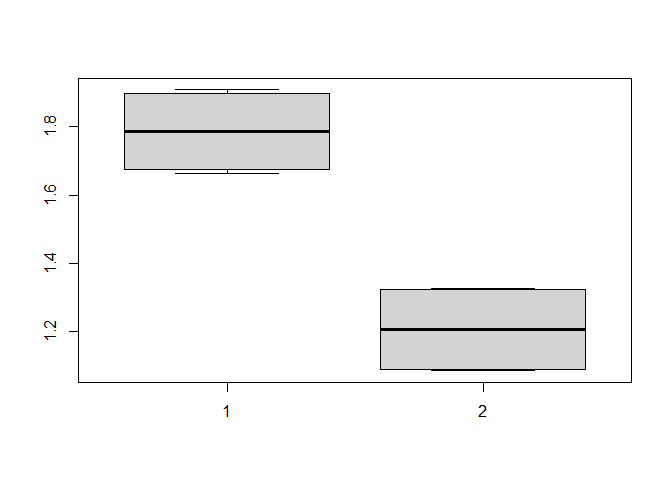

<!-- README.md is generated from README.Rmd. Please edit that file -->

# imediation

<!-- badges: start -->

<!-- badges: end -->

The goal of imediation is to provide an easy access to the individual
mediation effects in complicated multivariates situation.

## Installation

You can install the released version of imediation from
[CRAN](https://CRAN.R-project.org) with:

``` r
install.packages("imediation")
```

And the development version from [GitHub](https://github.com/) with:

``` r
# install.packages("devtools")
devtools::install_github("jiezhou-2/imediation")
```

``` r
library(imediation)
library(combinat)
#> 
#> Attaching package: 'combinat'
#> The following object is masked from 'package:utils':
#> 
#>     combn
library(pracma)
#> 
#> Attaching package: 'pracma'
#> The following object is masked from 'package:combinat':
#> 
#>     fact
library(igraph)
#> 
#> Attaching package: 'igraph'
#> The following objects are masked from 'package:stats':
#> 
#>     decompose, spectrum
#> The following object is masked from 'package:base':
#> 
#>     union
```

### Define the causal relationships among mediators for example 1-3.

``` r
#adjacency matrix
AA=matrix(0,nrow = 4,ncol =4)
A=matrix(c(0,1,0,0),nrow=2)
AA[c(2,4),1]=1
AA[3,1]=0
AA[4,c(1,2,3)]=1
AA[2:3,2:3]=A
#create graph
g1=graph_from_adjacency_matrix(adjmatrix = t(AA))
plot.igraph(g1)
```


### Example 1. A mediation model with 2 continuous mediators and binary treatment and outcome: Main-effect model

``` r
#data generation
set.seed(5)
size=200
 treatment=sample(x=c(0,1), size = size, replace = T,prob = c(0.5, 0.5))
  mediator=matrix(nrow = size, ncol = 2)
  error=matrix(nrow = size,ncol = 2)
  for (i in 1:size) {
    error[i,]=rnorm(n=2, mean=0, sd = 0.5)
  }

  mediator[,1]=0.5*treatment+error[,1]
  mediator[,2]=0.5*treatment+0.5*mediator[,1]+error[,2]
      expp=rep(0,size)
      p=rep(0,size)
      outcome=rep(0,size)
      for (i in 1:size) {
        expp[i]=0.5*treatment[i]+0.5*sum(mediator[i,])
        p[i]=exp(expp[i])/(1+exp(expp[i]))
        outcome[i]=rbinom(n=1,size=1,p=p[i])
      }
  data1=cbind(treatment,mediator,outcome)
  colnames(data1)=c("treatment",paste("mediator",1:2, sep = ""), "outcome")
  head(data1)
#>      treatment   mediator1  mediator2 outcome
#> [1,]         1 -0.49769348  0.8188089       1
#> [2,]         0  0.33789728  0.2731903       1
#> [3,]         0 -0.02892282  0.4324443       0
#> [4,]         1  0.38556731 -0.2900427       1
#> [5,]         1  0.12324478  1.2016982       0
#> [6,]         0 -0.47645248  0.5729635       1
```

``` r
#computation of mediation effects
form=vector( "list",2)
form[[1]]=rep(0,2)
form[[2]]=matrix(0,nrow = 2, ncol = 2)
result=regression(form = form,type = "binomial",data = data1,C=A)
mintercept = result$mcoe[1,]
mcov=result$mcov
ocoe_intercept=result$ocoe_intercept
ocoe_confounder=result$ocoe_confounder
ocoe_tm=result$ocoe_tm
ocoe_mm=result$ocoe_mm
p=2
BB=matrix(0,nrow = p+2,ncol = p+2)
BB[2:(p+1),1]=result$mcoe[2,]
BB[p+2,1]=result$ocoe_treatment
BB[p+2,2:(p+1)]=result$ocoe_mediator
BB[2:(p+1),2:(p+1)]=result$B
a1=combinat::hcube(rep(2,2), scale = 1)
us=ifelse(a1==1,0, 1)
effect1=matrix(nrow = 2^2,ncol = 2)
for (j in 1:2) {
 for (m in 1:2^2) {
   effect1[m,j]=beffect(
     index=j,
     u=us[m,],
     mintercept=mintercept,
     BB=BB,
     type="binomial",
     ocoe_tm=ocoe_tm,
     ocoe_confounder=ocoe_confounder,
     ocoe_intercept=ocoe_intercept,
     ocoe_mm=ocoe_mm
     )
 }
 }
 boxplot(effect1)
```


### Example 2. A mediation model with 2 continuous mediators and binary treatment and outcome: treatment-mediator-interaction-effect model

``` r
#data generation
size=200
 treatment=sample(x=c(0,1), size = size, replace = T,prob = c(0.5, 0.5))
  mediator=matrix(nrow = size, ncol = 2)
  error=matrix(nrow = size,ncol = 2)
  for (i in 1:size) {
    error[i,]=rnorm(n=2, mean=0, sd = 0.5)
  }

  mediator[,1]=0.5*treatment+error[,1]
  mediator[,2]=0.5*treatment+0.5*mediator[,1]+error[,2]
      expp=rep(0,size)
      p=rep(0,size)
      outcome=rep(0,size)
      for (i in 1:size) {
        expp[i]=0.5*treatment[i]+0.5*sum(mediator[i,])+0.5*treatment[i]*mediator[i,1]
        p[i]=exp(expp[i])/(1+exp(expp[i]))
        outcome[i]=rbinom(n=1,size=1,p=p[i])
      }
  data2=cbind(treatment,mediator,outcome)
  colnames(data2)=c("treatment",paste("mediator",1:2, sep = ""), "outcome")
  head(data2)
#>      treatment   mediator1 mediator2 outcome
#> [1,]         0  0.28884735 0.5075330       1
#> [2,]         1  0.64420274 0.6433699       1
#> [3,]         0  0.08444273 0.6232858       1
#> [4,]         0  0.04556401 0.2326180       0
#> [5,]         1 -0.26264062 0.8169748       1
#> [6,]         0  0.18458336 0.6286115       0
```

``` r
#computation of mediation effects
form=vector( "list",2)
form[[1]]=c(1,0)
form[[2]]=matrix(0,nrow = 2, ncol = 2)
result=regression(form = form,type = "binomial",data = data2,C=A)
mintercept = result$mcoe[1,]
mcov=result$mcov
ocoe_intercept=result$ocoe_intercept
ocoe_confounder=result$ocoe_confounder
ocoe_tm=result$ocoe_tm
ocoe_mm=result$ocoe_mm
p=2
BB=matrix(0,nrow = p+2,ncol = p+2)
BB[2:(p+1),1]=result$mcoe[2,]
BB[p+2,1]=result$ocoe_treatment
BB[p+2,2:(p+1)]=result$ocoe_mediator
BB[2:(p+1),2:(p+1)]=result$B
a1=combinat::hcube(rep(2,2), scale = 1)
us=ifelse(a1==1,0, 1)
effect2=matrix(nrow = 2^2,ncol = 2)
for (j in 1:2) {
 for (m in 1:2^2) {
   effect2[m,j]=beffect(
     index=j,
     u=us[m,],
     mintercept=mintercept,
     BB=BB,
     type="binomial",
     ocoe_tm=ocoe_tm,
     ocoe_confounder=ocoe_confounder,
     ocoe_intercept=ocoe_intercept,
     ocoe_mm=ocoe_mm
     )
 }
 }
 boxplot(effect2)
```


### Example 3. A mediation model with 2 continuous mediators and binary treatment and outcome: mediator-mediator-interaction-effect model

``` r
#data generation
size=200
 treatment=sample(x=c(0,1), size = size, replace = T,prob = c(0.5, 0.5))
  mediator=matrix(nrow = size, ncol = 2)
  error=matrix(nrow = size,ncol = 2)
  for (i in 1:size) {
    error[i,]=rnorm(n=2, mean=0, sd = 0.5)
  }

  mediator[,1]=0.5*treatment+error[,1]
  mediator[,2]=0.5*treatment+0.5*mediator[,1]+error[,2]
      expp=rep(0,size)
      p=rep(0,size)
      outcome=rep(0,size)
      for (i in 1:size) {
        expp[i]=0.5*treatment[i]+0.5*sum(mediator[i,])+0.5*mediator[i,2]*mediator[i,1]
        p[i]=exp(expp[i])/(1+exp(expp[i]))
        outcome[i]=rbinom(n=1,size=1,p=p[i])
      }
  data3=cbind(treatment,mediator,outcome)
  colnames(data3)=c("treatment",paste("mediator",1:2, sep = ""), "outcome")
  head(data3)
#>      treatment  mediator1   mediator2 outcome
#> [1,]         1  0.8607714  1.32199678       1
#> [2,]         0  0.2937118  0.48851004       0
#> [3,]         1  0.9163751  0.63545394       1
#> [4,]         0  0.2170382 -0.02617398       1
#> [5,]         0 -0.3701507 -0.34327495       0
#> [6,]         1 -0.5724202 -0.10333047       1
```

``` r
#computation of mediation effects
form=vector( "list",2)
form[[1]]=c(0,0)
form[[2]]=matrix(c(0,1,1,0),nrow = 2, ncol = 2)
result=regression(form = form,type = "binomial",data = data3,C=A)
mintercept = result$mcoe[1,]
mcov=result$mcov
ocoe_intercept=result$ocoe_intercept
ocoe_confounder=result$ocoe_confounder
ocoe_tm=result$ocoe_tm
ocoe_mm=result$ocoe_mm
p=2
BB=matrix(0,nrow = p+2,ncol = p+2)
BB[2:(p+1),1]=result$mcoe[2,]
BB[p+2,1]=result$ocoe_treatment
BB[p+2,2:(p+1)]=result$ocoe_mediator
BB[2:(p+1),2:(p+1)]=result$B
a1=combinat::hcube(rep(2,2), scale = 1)
us=ifelse(a1==1,0, 1)
effect3=matrix(nrow = 2^2,ncol = 2)
for (j in 1:2) {
 for (m in 1:2^2) {
   effect3[m,j]=beffect(
     index=j,
     u=us[m,],
     mintercept=mintercept,
     BB=BB,
     type="binomial",
     ocoe_tm=ocoe_tm,
     ocoe_confounder=ocoe_confounder,
     ocoe_intercept=ocoe_intercept,
     ocoe_mm=ocoe_mm
     )
 }
 }
 boxplot(effect3)
```



### Example 4. A mediation model with 10 continuous mediators and binary treatment and outcome: main-effect model

``` r
##adjacency matrix
AA=matrix(0,nrow = 12,ncol =12)
A=matrix(nrow = 10, ncol = 10)
A[10,]=c(0,0,0,1,0,0,0,0,0,0)
A[9,]=c(0,0,1,0,0,0,0,0,0,0)
A[8,]=c(0,0,1,0,0,0,0,0,0,0)
A[7,]=c(0,1,0,0,0,0,0,0,0,0)
A[6,]=c(0,1,0,0,0,0,0,0,0,0)
A[5,]=c(1,0,0,0,0,0,0,0,0,0)
A[4,]=c(0,0,0,0,0,0,0,0,0,0)
A[3,]=c(0,0,0,0,0,0,0,0,0,0)
A[2,]=c(0,0,0,0,0,0,0,0,0,0)
A[1,]=c(0,0,0,0,0,0,0,0,0,0)
AA[2:5,1]=1
AA[12,1]=1
AA[12,2:11]=1
AA[2:11,2:11]=A
#create graph 
g1=graph_from_adjacency_matrix(adjmatrix = t(AA))
plot.igraph(g1)
```


``` r
data4=binary(size = 200)
form=vector( "list",2)
form[[1]]=rep(0,10)
form[[2]]=matrix(0,nrow = 10, ncol = 10)
result=regression(form = form,type = "binomial",data = data4,C=A)
mintercept = result$mcoe[1,]
mcov=result$mcov
ocoe_intercept=result$ocoe_intercept
ocoe_confounder=result$ocoe_confounder
ocoe_tm=result$ocoe_tm
ocoe_mm=result$ocoe_mm
p=10
BB=matrix(0,nrow = p+2,ncol = p+2)
BB[2:(p+1),1]=result$mcoe[2,]
BB[p+2,1]=result$ocoe_treatment
BB[p+2,2:(p+1)]=result$ocoe_mediator
BB[2:(p+1),2:(p+1)]=result$B
a1=combinat::hcube(rep(2,10), scale = 1)
us=ifelse(a1==1,0, 1)
effect4=matrix(nrow = 2^5,ncol = 3)
s=c(1,2,5)
for (j in 1:3) {
 for (m in 1:2^5) {
   effect4[m,j]=beffect(
     index=s[j],
     u=us[m,],
     mintercept=mintercept,
     BB=BB,
     type="binomial",
     ocoe_tm=ocoe_tm,
     ocoe_confounder=ocoe_confounder,
     ocoe_intercept=ocoe_intercept,
     ocoe_mm=ocoe_mm
     )
 }
 }
 boxplot(effect4)
```


### Example 5. A high-dimensional mediation model with 100 continuous mediators and binary treatment and outcome

``` r
set.seed(4)
A=matrix(sample(x=c(0,1),size=10000, replace=T,prob=c(0.98,0.02)), nrow=100,ncol=100)
A[upper.tri(A)]=0
diag(A)=0
AA=matrix(0,nrow = 102,ncol = 102)
AA[2:102,1]=1
AA[102,2:101]=1
AA[2:101,2:101]=A
g5=graph_from_adjacency_matrix(t(AA))
plot.igraph(g5)
```


``` r
is.dag(g5)
#> [1] TRUE
```

``` r
#data generation
size=200
BB=0.5*AA
 treatment=sample(x=c(0,1), size = size, replace = T,prob = c(0.5, 0.5))
  mediators=matrix(nrow = size, ncol = 100)
  error=matrix(nrow = size,ncol = 100)
  for (i in 1:size) {
    error[i,]=rnorm(n=100, mean=0, sd = 0.5)
  }
  x=as.matrix(treatment)
for (j in 1:100) {
  b=BB[(j+1),1:j]
  mediators[,j]=x%*%b+error[,j]
  x=as.matrix(cbind(x,mediators[,j]))
}
      expp=rep(0,size)
      p=rep(0,size)
      outcome=rep(0,size)
      for (i in 1:size) {
        expp[i]=0.5*treatment[i]+0.5*sum(mediators[i,])
        p[i]=exp(expp[i])/(1+exp(expp[i]))
        outcome[i]=rbinom(n=1,size=1,p=p[i])
      }
  data5=cbind(treatment,mediators,outcome)
  colnames(data5)=c("treatment",paste("mediator",1:100, sep = ""), "outcome")
  head(data5)
#>      treatment  mediator1 mediator2   mediator3   mediator4  mediator5
#> [1,]         1 -0.5017263 1.2627478  1.29805290  0.02335253 0.86217176
#> [2,]         1  1.0997371 0.5612546  0.92799336  1.89435333 0.03176871
#> [3,]         1  0.1109514 0.5918143  0.38444400 -0.24098526 0.40181158
#> [4,]         1 -0.1753246 0.2575152  0.07368449  1.07730206 0.64290435
#> [5,]         0 -0.2071269 0.2301423 -0.64044276 -0.24720307 0.62143633
#> [6,]         1  0.1668506 0.5179588  0.66873052  0.31527171 0.31172040
#>       mediator6   mediator7  mediator8   mediator9 mediator10  mediator11
#> [1,]  0.6321953  0.26593043  0.1242462  0.51217885  0.6818744  0.80761686
#> [2,] -0.4767130  0.32631639  1.6562629  0.63157372  0.5314665  0.58253276
#> [3,]  0.5270259  0.42440777  1.4267541 -0.34949049  0.5514769 -0.09736362
#> [4,]  0.7977462  0.26873940  0.6844077  0.43523521  0.9336753  0.47454173
#> [5,] -1.1138806  0.23813404 -0.3305014 -0.02805137  0.4645168 -0.11610244
#> [6,]  1.8778882 -0.03533805  0.2304614 -0.29022060  0.9995563  0.77218805
#>       mediator12  mediator13  mediator14 mediator15  mediator16 mediator17
#> [1,]  1.16404224  0.07406215  1.47250674  0.6009735  0.64916293  0.7267714
#> [2,]  0.09890021 -0.01338240  0.16017513  0.2354748 -0.18539698  0.7916741
#> [3,]  0.19858857  0.23785989  0.05393446  0.3650002  1.06593426  0.9908156
#> [4,]  1.05354936  0.26785235 -0.03474444  0.8241716  0.22736764  0.8064244
#> [5,] -0.20302578 -0.02664786 -0.18767076  0.3016611  0.07053077  0.3432558
#> [6,]  1.23724595  0.55635798  0.28909517 -0.4921976  0.70730261  0.7072712
#>      mediator18   mediator19 mediator20 mediator21 mediator22  mediator23
#> [1,] -0.1179388 -0.189920644  1.2396219  0.4632907  0.5079296  1.49831961
#> [2,]  0.6244218  1.190769912  0.2144775  0.7965605  1.0001478  1.42639627
#> [3,]  0.2290831  0.077903932  1.3591640  1.1429023  0.7090085 -0.01077716
#> [4,]  0.9502060 -0.001113373  1.0283628  0.4366150  0.8546531  0.48868838
#> [5,]  0.4340846 -0.840852345  0.2281626 -0.5946221 -0.1811560 -0.28115393
#> [6,]  0.9829015  0.200529266  0.6538507  0.1796553  0.8314443  1.20530127
#>      mediator24 mediator25 mediator26 mediator27  mediator28  mediator29
#> [1,] -0.3954455  0.8603959  0.1643318  2.5758733  2.06353953  0.84568969
#> [2,]  0.6869714  0.3608775  1.4089028  0.3029121  0.76109680  0.22062377
#> [3,]  0.4104793  0.4189679  1.2646881  0.4181181 -0.02075539  1.03422746
#> [4,]  0.1900823  0.4118588  0.9337003 -0.1693691  1.13037977  0.25156209
#> [5,] -0.5775079 -0.3285829  0.0890827  0.2205515 -0.09390162 -0.04516132
#> [6,]  1.2654634  0.2478751  1.3785218  0.1925797  0.18960432  1.22788605
#>      mediator30 mediator31 mediator32 mediator33  mediator34 mediator35
#> [1,]  0.2059731  0.8578254 -0.3854728  0.4289028  0.88750121  0.6503802
#> [2,]  0.9838356  0.6455912 -0.3411214  0.7563685 -0.06570738  0.9809399
#> [3,] -0.1098178  1.2075765  0.9352382  0.8084247  0.22047413  0.3318786
#> [4,]  0.3934320  1.1816382  0.4627585  0.2839140  0.04549696  0.7672471
#> [5,]  0.2129357 -0.7288616  0.1072320  0.2432582 -0.34731748  0.7637245
#> [6,]  0.6184741  1.7742833  0.8984864  0.2235833  1.67650213 -0.3034815
#>      mediator36  mediator37  mediator38 mediator39 mediator40 mediator41
#> [1,]  0.9988563  0.18826375  0.81793237  0.4865054  1.1768447  0.9053196
#> [2,]  0.7390130  0.77533823  0.74509364  1.7569242  0.0721960  1.2925255
#> [3,]  0.4491976 -0.04810081 -0.01246546  0.8575675  1.1075336  0.9660226
#> [4,]  0.4277044  0.85367333  0.81104328  1.8126362 -0.2266601  1.3511903
#> [5,]  0.4442894 -0.54787053  0.99170850  0.1721521  0.3140866 -0.3258735
#> [6,]  0.4444774 -0.03261276 -0.15175293  0.8409173  0.4992038  0.7831355
#>      mediator42  mediator43 mediator44 mediator45 mediator46 mediator47
#> [1,] -0.2153609  1.26407436  1.4380664 0.85107957   1.231467  1.1122549
#> [2,]  1.2360330  0.38197531  1.1178898 1.08214134   1.675472  0.4239647
#> [3,]  0.3894277  0.56280606  0.5716780 0.38597893   1.201821  1.5877634
#> [4,]  0.9865186  1.44403173  0.2962886 0.85840306   1.536091  1.8860691
#> [5,]  0.3205595 -0.07627874  0.4492746 0.09367889   0.175881 -0.4551527
#> [6,]  0.7301991  0.94703783  0.6317900 1.51127163   1.524551  0.7129319
#>      mediator48 mediator49 mediator50 mediator51 mediator52  mediator53
#> [1,]  0.9173386  0.5011963   1.548959  1.1098779 0.43041876  1.11232951
#> [2,]  1.0121871  1.4172289   3.149964  0.9641074 1.04247098  1.74056397
#> [3,]  0.3802822  0.8479532   2.211036  0.6520187 1.55732616  1.36119084
#> [4,]  0.9737406  0.9064421   1.671758 -0.1801244 0.92146956  2.06450081
#> [5,] -0.6543438 -0.6383150   0.496866 -0.2615898 0.02747233 -0.07449908
#> [6,]  1.5827578  0.9478840   2.362860  0.3405458 0.55038837  2.06193597
#>      mediator54 mediator55 mediator56  mediator57  mediator58  mediator59
#> [1,] -0.3339212  2.0237526 0.73530103  2.48383327  2.78802007  0.63527261
#> [2,] -0.0725689  1.2280482 1.63259302 -0.60214420  0.08934075  0.99934018
#> [3,]  0.7797180  0.9385931 0.91704305  1.84222236  0.32808439  1.58722635
#> [4,]  1.1801281  0.6441233 1.24767404 -0.31678607  0.82629270  2.76020538
#> [5,]  0.6433964  0.2485038 0.06286875 -0.01923012 -0.82561821 -0.09731221
#> [6,]  0.5509173  2.8004757 0.64849655  1.31527160  0.66650295  2.14824250
#>        mediator60 mediator61 mediator62 mediator63 mediator64 mediator65
#> [1,] -0.549958729  1.5287571  1.5866311  0.8730596  0.1855639  2.3477541
#> [2,]  0.898849744  1.9678591 -0.6318542  0.4869929  0.2359911  2.0560917
#> [3,]  0.048088369  1.1308683  0.2780514  0.2433730  0.9399067  1.8309221
#> [4,] -0.096681069  1.5204860  0.2098109  0.3226471  0.5988184  1.7641655
#> [5,] -0.006694459 -0.7359928  0.1770510 -0.4628634  0.5413780 -0.2312675
#> [6,]  0.585149567  0.9294366  0.3503126  1.2612256  0.9108521  2.1908984
#>      mediator66 mediator67  mediator68 mediator69  mediator70 mediator71
#> [1,]  2.1247646  0.7271974  1.70565292  0.2660351  0.09278308 0.91928445
#> [2,]  2.0888971  0.2170768  1.23477981  1.1468601 -0.74373112 0.61564766
#> [3,]  1.6712356 -0.1095684  1.06210984  0.8812411  0.89649042 0.03375186
#> [4,]  1.0732745  0.8944369  1.57601742  0.1406340  0.95261736 0.76795624
#> [5,] -0.5083637 -0.1905107 -0.02705351  0.8864094  0.21354891 0.05983594
#> [6,]  2.8713383  1.1513305  1.49269893  0.9865480  0.57170488 0.81770078
#>      mediator72 mediator73 mediator74 mediator75   mediator76 mediator77
#> [1,]  1.1405575  0.4027957  0.5376920  1.3481139  0.160126132  2.4670428
#> [2,]  1.1396202 -0.1795644  0.4719381  0.6905055  0.659490969  1.5166875
#> [3,]  0.4248871  1.0207766  1.5162191  0.2955881  0.834906223  2.0493493
#> [4,] -0.4103441  0.0049021  1.6377704  0.5726617 -0.343547176  0.6797170
#> [5,] -0.9206081 -0.4725382 -0.9148646  0.2767305  0.106484824 -0.8278562
#> [6,]  0.3893722  0.2042568  0.5976967  0.8154676  0.009131179  2.2041754
#>      mediator78 mediator79  mediator80  mediator81 mediator82 mediator83
#> [1,]  1.5990907  1.2117134  1.40127505  0.30860560  0.9398185   2.940950
#> [2,]  1.7604530  0.3432582  0.26236368  0.41760400  0.7049610   1.328534
#> [3,]  1.5421323  0.4521088  0.76741814  1.01466303  0.8677477   2.408271
#> [4,]  0.9198752  0.4196048  0.91387041 -0.07250421  0.7662838   3.066583
#> [5,]  0.6823844 -0.1022613 -0.07876409  0.25605486 -0.3421782   0.180337
#> [6,]  1.0747319  1.0733816  0.96168285  0.64546382  1.2917459   2.253161
#>      mediator84 mediator85 mediator86 mediator87 mediator88 mediator89
#> [1,]  3.5729654 1.62598574  0.6521772  1.6988386  0.5741467  2.8705405
#> [2,]  3.1467002 2.68179712  0.5239540  1.3489895  1.5900972  2.6074541
#> [3,]  3.6002511 1.88719899  0.9805902  0.4731854  0.5025404  2.0783055
#> [4,]  0.9013351 2.38776339  1.1875925  1.5568270  0.9654759  2.5673522
#> [5,] -1.6532578 0.05469114 -0.7083563 -0.1817629  0.2951079 -0.9363036
#> [6,]  3.5610705 1.55178042  0.1491880  1.0851747  1.2850367  1.4487527
#>      mediator90 mediator91  mediator92 mediator93 mediator94 mediator95
#> [1,]   3.532926  0.9437089  1.66697017  3.5731805  0.6166410  1.8353128
#> [2,]   2.340641  1.0509249  1.04499291  2.0536641  1.6755711  1.4219997
#> [3,]   2.873277  1.0321047  1.76228241  2.1317760  1.6902794  1.7890575
#> [4,]   2.050441  0.3527566  2.64437014  2.7069142  1.9812813  1.3755699
#> [5,]  -0.294579 -0.1980799 -0.06283843 -0.3809079  0.4763582  0.1400975
#> [6,]   1.873740  1.2331181  1.46826253  2.0831211  2.0562901  1.5666798
#>      mediator96  mediator97  mediator98 mediator99 mediator100 outcome
#> [1,]  3.2977686  0.15806652  1.83484946  0.6492953  1.51585683       1
#> [2,]  1.2512550  0.09907882  0.64084388 -0.2328800  0.73487035       1
#> [3,]  1.8149946  1.87672503  0.34351612 -0.5418595  0.92745135       1
#> [4,]  1.0897894  1.72899762  0.71587091  1.4060549 -0.26128090       1
#> [5,] -0.1899305 -0.41327448 -0.05498222 -0.3653646  0.67804083       0
#> [6,]  2.5715646  0.03622454  0.20394823  0.9538464  0.01577029       1
```

``` r
form=vector( "list",2)
form[[1]]=rep(0,100)
form[[2]]=matrix(0,nrow = 100, ncol = 100)
result=regression(form = form,type = "binomial",data = data5,C=A)
#> Warning: glm.fit: algorithm did not converge
#> Warning: glm.fit: fitted probabilities numerically 0 or 1 occurred
mintercept = result$mcoe[1,]
mcov=result$mcov
ocoe_intercept=result$ocoe_intercept
ocoe_confounder=result$ocoe_confounder
ocoe_tm=result$ocoe_tm
ocoe_mm=result$ocoe_mm
p=100
BB=matrix(0,nrow = p+2,ncol = p+2)
BB[2:(p+1),1]=result$mcoe[2,]
BB[p+2,1]=result$ocoe_treatment
BB[p+2,2:(p+1)]=result$ocoe_mediator
BB[2:(p+1),2:(p+1)]=result$B
u=rep(0,100)
effect5=rep(0,100)
for (j in 1:100) {
   effect5[j]=beffect(
     index=j,
     u=u,
     mintercept=mintercept,
     BB=BB,
     type="binomial",
     ocoe_tm=ocoe_tm,
     ocoe_confounder=ocoe_confounder,
     ocoe_intercept=ocoe_intercept,
     ocoe_mm=ocoe_mm
     )
 }
 boxplot(effect5)
```


