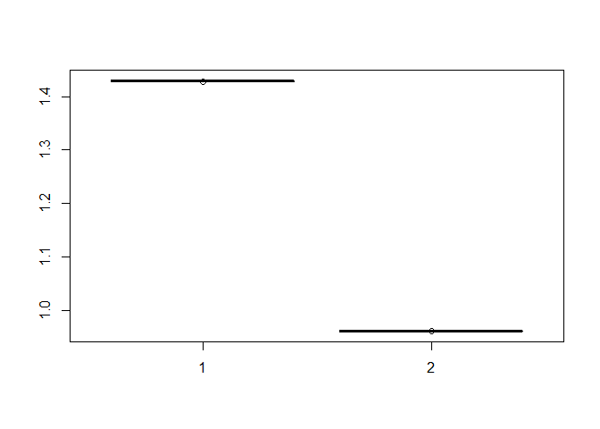
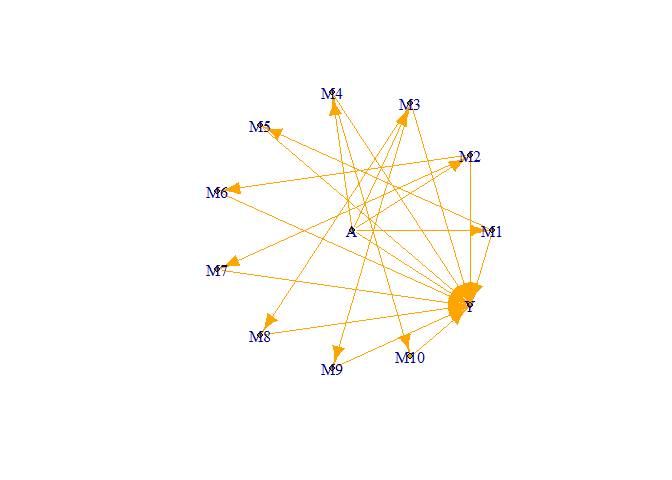

<!-- README.md is generated from README.Rmd. Please edit that file -->

# imediation

<!-- badges: start -->

<!-- badges: end -->

The goal of imediation is to provide an easy access to the individual
mediation effects in complicated multivariates situation.

## Installation

You can install the released version of imediation from
[CRAN](https://CRAN.R-project.org) with:

``` r
install.packages("imediation")
```

And the development version from [GitHub](https://github.com/) with:

``` r
# install.packages("devtools")
devtools::install_github("jiezhou-2/imediation")
```

``` r
library(imediation)
library(combinat)
#> 
#> Attaching package: 'combinat'
#> The following object is masked from 'package:utils':
#> 
#>     combn
library(pracma)
#> 
#> Attaching package: 'pracma'
#> The following object is masked from 'package:combinat':
#> 
#>     fact
library(igraph)
#> 
#> Attaching package: 'igraph'
#> The following objects are masked from 'package:stats':
#> 
#>     decompose, spectrum
#> The following object is masked from 'package:base':
#> 
#>     union
```

### Define the causal relationships among mediators for example 1-3.

``` r
#adjacency matrix
AA=matrix(0,nrow = 4,ncol =4)
A=matrix(c(0,1,0,0),nrow=2)
AA[c(2,4),1]=1
AA[3,1]=0
AA[4,c(1,2,3)]=1
AA[2:3,2:3]=A
#create graph
g1=graph_from_adjacency_matrix(adjmatrix = t(AA))
plot.igraph(g1)
```


### Example 1. A mediation model with 2 continuous mediators and binary treatment and outcome: Main-effect model

``` r
#data generation
set.seed(1)
size=200
 treatment=sample(x=c(0,1), size = size, replace = T,prob = c(0.5, 0.5))
  mediator=matrix(nrow = size, ncol = 2)
  error=matrix(nrow = size,ncol = 2)
  for (i in 1:size) {
    error[i,]=rnorm(n=2, mean=0, sd = 0.5)
  }

  mediator[,1]=0.5*treatment+error[,1]
  mediator[,2]=0.5*treatment+0.5*mediator[,1]+error[,2]
      expp=rep(0,size)
      p=rep(0,size)
      outcome=rep(0,size)
      for (i in 1:size) {
        expp[i]=0.5*treatment[i]+0.5*sum(mediator[i,])
        p[i]=exp(expp[i])/(1+exp(expp[i]))
        outcome[i]=rbinom(n=1,size=1,p=p[i])
      }
  data1=cbind(treatment,mediator,outcome)
  colnames(data1)=c("treatment",paste("mediator",1:2, sep = ""), "outcome")
  head(data1)
#>      treatment   mediator1  mediator2 outcome
#> [1,]         1  0.18981666  0.6159663       1
#> [2,]         1  0.04453918  0.6012840       1
#> [3,]         0 -0.32729232  0.7199975       1
#> [4,]         0  0.35835374  0.6342640       0
#> [5,]         1  0.69209268  1.6871344       1
#> [6,]         0 -0.31786823 -0.3897565       0
```

``` r
#computation of mediation effects
form=vector( "list",2)
form[[1]]=rep(0,2)
form[[2]]=matrix(0,nrow = 2, ncol = 2)
result=regression(form = form,type = "binomial",data = data1,C=A)
mintercept = result$mcoe[1,]
mcov=result$mcov
ocoe_intercept=result$ocoe_intercept
ocoe_confounder=result$ocoe_confounder
ocoe_tm=result$ocoe_tm
ocoe_mm=result$ocoe_mm
p=2
BB=matrix(0,nrow = p+2,ncol = p+2)
BB[2:(p+1),1]=result$mcoe[2,]
BB[p+2,1]=result$ocoe_treatment
BB[p+2,2:(p+1)]=result$ocoe_mediator
BB[2:(p+1),2:(p+1)]=result$B
a1=combinat::hcube(rep(2,2), scale = 1)
us=ifelse(a1==1,0, 1)
effect1=matrix(nrow = 2^2,ncol = 2)
for (j in 1:2) {
 for (m in 1:2^2) {
   effect1[m,j]=beffect(
     index=j,
     u=us[m,],
     mintercept=mintercept,
     BB=BB,
     type="binomial",
     ocoe_tm=ocoe_tm,
     ocoe_confounder=ocoe_confounder,
     ocoe_intercept=ocoe_intercept,
     ocoe_mm=ocoe_mm
     )
 }
 }
 boxplot(effect1)
```



### Example 2. A mediation model with 2 continuous mediators and binary treatment and outcome: treatment-mediator-interaction-effect model

``` r
#data generation
size=200
 treatment=sample(x=c(0,1), size = size, replace = T,prob = c(0.5, 0.5))
  mediator=matrix(nrow = size, ncol = 2)
  error=matrix(nrow = size,ncol = 2)
  for (i in 1:size) {
    error[i,]=rnorm(n=2, mean=0, sd = 0.5)
  }

  mediator[,1]=0.5*treatment+error[,1]
  mediator[,2]=0.5*treatment+0.5*mediator[,1]+error[,2]
      expp=rep(0,size)
      p=rep(0,size)
      outcome=rep(0,size)
      for (i in 1:size) {
        expp[i]=0.5*treatment[i]+0.5*sum(mediator[i,])+0.5*treatment[i]*mediator[i,1]
        p[i]=exp(expp[i])/(1+exp(expp[i]))
        outcome[i]=rbinom(n=1,size=1,p=p[i])
      }
  data2=cbind(treatment,mediator,outcome)
  colnames(data2)=c("treatment",paste("mediator",1:2, sep = ""), "outcome")
  head(data2)
#>      treatment mediator1 mediator2 outcome
#> [1,]         1 0.6309487 0.8693239       1
#> [2,]         0 0.4154608 0.6383676       1
#> [3,]         1 0.6651546 1.3775585       1
#> [4,]         0 0.2993943 0.3982184       0
#> [5,]         1 0.2709651 1.0942152       1
#> [6,]         1 0.2948308 0.2343640       1
```

``` r
#computation of mediation effects
form=vector( "list",2)
form[[1]]=c(1,0)
form[[2]]=matrix(0,nrow = 2, ncol = 2)
result=regression(form = form,type = "binomial",data = data2,C=A)
mintercept = result$mcoe[1,]
mcov=result$mcov
ocoe_intercept=result$ocoe_intercept
ocoe_confounder=result$ocoe_confounder
ocoe_tm=result$ocoe_tm
ocoe_mm=result$ocoe_mm
p=2
BB=matrix(0,nrow = p+2,ncol = p+2)
BB[2:(p+1),1]=result$mcoe[2,]
BB[p+2,1]=result$ocoe_treatment
BB[p+2,2:(p+1)]=result$ocoe_mediator
BB[2:(p+1),2:(p+1)]=result$B
a1=combinat::hcube(rep(2,2), scale = 1)
us=ifelse(a1==1,0, 1)
effect2=matrix(nrow = 2^2,ncol = 2)
for (j in 1:2) {
 for (m in 1:2^2) {
   effect2[m,j]=beffect(
     index=j,
     u=us[m,],
     mintercept=mintercept,
     BB=BB,
     type="binomial",
     ocoe_tm=ocoe_tm,
     ocoe_confounder=ocoe_confounder,
     ocoe_intercept=ocoe_intercept,
     ocoe_mm=ocoe_mm
     )
 }
 }
 boxplot(effect2)
```


### Example 3. A mediation model with 2 continuous mediators and binary treatment and outcome: mediator-mediator-interaction-effect model

``` r
#data generation
size=200
 treatment=sample(x=c(0,1), size = size, replace = T,prob = c(0.5, 0.5))
  mediator=matrix(nrow = size, ncol = 2)
  error=matrix(nrow = size,ncol = 2)
  for (i in 1:size) {
    error[i,]=rnorm(n=2, mean=0, sd = 0.5)
  }

  mediator[,1]=0.5*treatment+error[,1]
  mediator[,2]=0.5*treatment+0.5*mediator[,1]+error[,2]
      expp=rep(0,size)
      p=rep(0,size)
      outcome=rep(0,size)
      for (i in 1:size) {
        expp[i]=0.5*treatment[i]+0.5*sum(mediator[i,])+0.5*mediator[i,2]*mediator[i,1]
        p[i]=exp(expp[i])/(1+exp(expp[i]))
        outcome[i]=rbinom(n=1,size=1,p=p[i])
      }
  data3=cbind(treatment,mediator,outcome)
  colnames(data3)=c("treatment",paste("mediator",1:2, sep = ""), "outcome")
  head(data3)
#>      treatment  mediator1   mediator2 outcome
#> [1,]         0 -0.4533926 -0.65674116       0
#> [2,]         0  0.7646550  0.21776277       1
#> [3,]         1  0.1723178 -0.01444414       1
#> [4,]         0 -0.2134085 -0.21783532       1
#> [5,]         0  0.4009847  0.26031090       0
#> [6,]         1 -0.0964972  1.19928243       0
```

``` r
#computation of mediation effects
form=vector( "list",2)
form[[1]]=c(0,0)
form[[2]]=matrix(c(0,1,1,0),nrow = 2, ncol = 2)
result=regression(form = form,type = "binomial",data = data3,C=A)
mintercept = result$mcoe[1,]
mcov=result$mcov
ocoe_intercept=result$ocoe_intercept
ocoe_confounder=result$ocoe_confounder
ocoe_tm=result$ocoe_tm
ocoe_mm=result$ocoe_mm
p=2
BB=matrix(0,nrow = p+2,ncol = p+2)
BB[2:(p+1),1]=result$mcoe[2,]
BB[p+2,1]=result$ocoe_treatment
BB[p+2,2:(p+1)]=result$ocoe_mediator
BB[2:(p+1),2:(p+1)]=result$B
a1=combinat::hcube(rep(2,2), scale = 1)
us=ifelse(a1==1,0, 1)
effect3=matrix(nrow = 2^2,ncol = 2)
for (j in 1:2) {
 for (m in 1:2^2) {
   effect3[m,j]=beffect(
     index=j,
     u=us[m,],
     mintercept=mintercept,
     BB=BB,
     type="binomial",
     ocoe_tm=ocoe_tm,
     ocoe_confounder=ocoe_confounder,
     ocoe_intercept=ocoe_intercept,
     ocoe_mm=ocoe_mm
     )
 }
 }
 boxplot(effect3)
```


### Example 4. A mediation model with 10 continuous mediators and binary treatment and outcome: main-effect model

``` r
##adjacency matrix
AA=matrix(0,nrow = 12,ncol =12)
A=matrix(nrow = 10, ncol = 10)
A[10,]=c(0,0,0,1,0,0,0,0,0,0)
A[9,]=c(0,0,1,0,0,0,0,0,0,0)
A[8,]=c(0,0,1,0,0,0,0,0,0,0)
A[7,]=c(0,1,0,0,0,0,0,0,0,0)
A[6,]=c(0,1,0,0,0,0,0,0,0,0)
A[5,]=c(1,0,0,0,0,0,0,0,0,0)
A[4,]=c(0,0,0,0,0,0,0,0,0,0)
A[3,]=c(0,0,0,0,0,0,0,0,0,0)
A[2,]=c(0,0,0,0,0,0,0,0,0,0)
A[1,]=c(0,0,0,0,0,0,0,0,0,0)
AA[2:5,1]=1
AA[12,1]=1
AA[12,2:11]=1
AA[2:11,2:11]=A
#create graph 
g1=graph_from_adjacency_matrix(adjmatrix = t(AA))
plot.igraph(g1)
```


``` r
data=binary(size = 200)
form=vector( "list",2)
form[[1]]=rep(0,10)
form[[2]]=matrix(0,nrow = 10, ncol = 10)
result=regression(form = form,type = "binomial",data = data,C=A)
mintercept = result$mcoe[1,]
mcov=result$mcov
ocoe_intercept=result$ocoe_intercept
ocoe_confounder=result$ocoe_confounder
ocoe_tm=result$ocoe_tm
ocoe_mm=result$ocoe_mm
p=10
BB=matrix(0,nrow = p+2,ncol = p+2)
BB[2:(p+1),1]=result$mcoe[2,]
BB[p+2,1]=result$ocoe_treatment
BB[p+2,2:(p+1)]=result$ocoe_mediator
BB[2:(p+1),2:(p+1)]=result$B
a1=combinat::hcube(rep(2,10), scale = 1)
us=ifelse(a1==1,0, 1)
effect2=matrix(nrow = 2^5,ncol = 3)
s=c(1,2,5)
for (j in 1:3) {
 for (m in 1:2^5) {
   effect2[m,j]=beffect(
     index=s[j],
     u=us[m,],
     mintercept=mintercept,
     BB=BB,
     type="binomial",
     ocoe_tm=ocoe_tm,
     ocoe_confounder=ocoe_confounder,
     ocoe_intercept=ocoe_intercept,
     ocoe_mm=ocoe_mm
     )
 }
 }
 boxplot(effect2)
```



### Example 5. A high-dimensional mediation model with 100 continuous mediators and binary treatment and outcome
