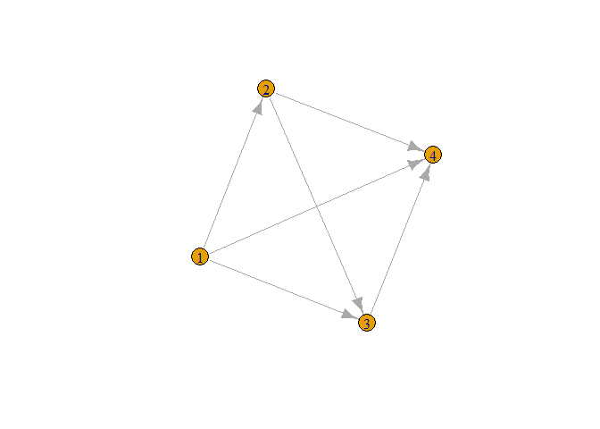

<!-- README.md is generated from README.Rmd. Please edit that file -->

# imediation

<!-- badges: start -->

<!-- badges: end -->

The goal of imediation is to provide an easy access to the individual
mediation effects in complicated multivariates situation.

## Installation

You can install the released version of imediation from
[CRAN](https://CRAN.R-project.org) with:

``` r
install.packages("imediation")
```

And the development version from [GitHub](https://github.com/) with:

``` r
# install.packages("devtools")
devtools::install_github("jiezhou-2/imediation")
```

``` r
library(imediation)
library(combinat)
#> 
#> Attaching package: 'combinat'
#> The following object is masked from 'package:utils':
#> 
#>     combn
library(pracma)
#> 
#> Attaching package: 'pracma'
#> The following object is masked from 'package:combinat':
#> 
#>     fact
library(igraph)
#> 
#> Attaching package: 'igraph'
#> The following objects are masked from 'package:stats':
#> 
#>     decompose, spectrum
#> The following object is masked from 'package:base':
#> 
#>     union
```

### Define the causal relationships among mediators for example 1-3.

``` r
#adjacency matrix
AA=matrix(0,nrow = 4,ncol =4)
A=matrix(c(0,1,0,0),nrow=2)
AA[c(2,3,4),1]=1
AA[4,c(1,2,3)]=1
AA[2:3,2:3]=A
#create graph
g1=graph_from_adjacency_matrix(adjmatrix = t(AA))
plot.igraph(g1)
```



### Example 1. A mediation model with 2 continuous mediators and binary treatment and outcome: Main-effect model

``` r
#data generation
size=200
 treatment=sample(x=c(0,1), size = size, replace = T,prob = c(0.5, 0.5))
  mediator=matrix(nrow = size, ncol = 2)
  error=matrix(nrow = size,ncol = 2)
  for (i in 1:size) {
    error[i,]=rnorm(n=2, mean=0, sd = 0.5)
  }

  mediator[,1]=0.5*treatment+error[,1]
  mediator[,2]=0.5*treatment+0.5*mediator[,1]+error[,2]
      expp=rep(0,size)
      p=rep(0,size)
      outcome=rep(0,size)
      for (i in 1:size) {
        expp[i]=0.5*treatment[i]+0.5*sum(mediator[i,])
        p[i]=exp(expp[i])/(1+exp(expp[i]))
        outcome[i]=rbinom(n=1,size=1,p=p[i])
      }
  data1=cbind(treatment,mediator,outcome)
  colnames(data1)=c("treatment",paste("mediator",1:2, sep = ""), "outcome")
```

``` r
#computation of mediation effects
form=vector( "list",2)
form[[1]]=rep(0,2)
form[[2]]=matrix(0,nrow = 2, ncol = 2)
ime(index=1,u=c(0,0),AA=AA,data = data1,form = form,type = "binomial")
#> [1] 1.538741
ime(index=2,u=c(0,0),AA=AA,data = data1,form = form,type = "binomial")
#> [1] 1.399055
```

### Example 2. A mediation model with 2 continuous mediators and binary treatment and outcome: treatment-mediator-interaction-effect model

``` r
#data generation
size=200
 treatment=sample(x=c(0,1), size = size, replace = T,prob = c(0.5, 0.5))
  mediator=matrix(nrow = size, ncol = 2)
  error=matrix(nrow = size,ncol = 2)
  for (i in 1:size) {
    error[i,]=rnorm(n=2, mean=0, sd = 0.5)
  }

  mediator[,1]=0.5*treatment+error[,1]
  mediator[,2]=0.5*treatment+0.5*mediator[,1]+error[,2]
      expp=rep(0,size)
      p=rep(0,size)
      outcome=rep(0,size)
      for (i in 1:size) {
        expp[i]=0.5*treatment[i]+0.5*sum(mediator[i,])+0.5*treatment[i]*mediator[i,1]
        p[i]=exp(expp[i])/(1+exp(expp[i]))
        outcome[i]=rbinom(n=1,size=1,p=p[i])
      }
  data2=cbind(treatment,mediator,outcome)
  colnames(data2)=c("treatment",paste("mediator",1:2, sep = ""), "outcome")
  head(data2)
#>      treatment  mediator1 mediator2 outcome
#> [1,]         1  1.3943825 0.6974971       1
#> [2,]         0 -0.3148659 0.0332907       1
#> [3,]         1  0.2241190 0.5108918       0
#> [4,]         1 -0.2603572 0.8852602       0
#> [5,]         1  0.6461804 0.5222385       0
#> [6,]         1  0.6233130 0.1631071       1
```

``` r
#computation of mediation effects
form=vector( "list",2)
form[[1]]=c(0,0)
form[[2]]=matrix(0,nrow = 2, ncol = 2)
ime(index=1,u=c(0,0),AA=AA,data = data1,form = form,type = "binomial")
#> [1] 1.537586
ime(index=2,u=c(0,0),AA=AA,data = data1,form = form,type = "binomial")
#> [1] 1.399177
```

### Example 3. A mediation model with 2 continuous mediators and binary treatment and outcome: mediator-mediator-interaction-effect model

``` r
#data generation
size=200
 treatment=sample(x=c(0,1), size = size, replace = T,prob = c(0.5, 0.5))
  mediator=matrix(nrow = size, ncol = 2)
  error=matrix(nrow = size,ncol = 2)
  for (i in 1:size) {
    error[i,]=rnorm(n=2, mean=0, sd = 0.5)
  }

  mediator[,1]=0.5*treatment+error[,1]
  mediator[,2]=0.5*treatment+0.5*mediator[,1]+error[,2]
      expp=rep(0,size)
      p=rep(0,size)
      outcome=rep(0,size)
      for (i in 1:size) {
        expp[i]=0.5*treatment[i]+0.5*sum(mediator[i,])+0.5*mediator[i,2]*mediator[i,1]
        p[i]=exp(expp[i])/(1+exp(expp[i]))
        outcome[i]=rbinom(n=1,size=1,p=p[i])
      }
  data3=cbind(treatment,mediator,outcome)
  colnames(data3)=c("treatment",paste("mediator",1:2, sep = ""), "outcome")
  head(data3)
#>      treatment  mediator1  mediator2 outcome
#> [1,]         0  0.3628941  0.7150455       0
#> [2,]         0 -0.1553030  0.6890699       0
#> [3,]         1  1.3892499  1.8652244       0
#> [4,]         0 -0.2073995 -0.2562862       1
#> [5,]         1  0.4117758  1.2439085       0
#> [6,]         1  0.9330623  0.7632853       1
```

``` r
#computation of mediation effects
form=vector( "list",2)
form[[1]]=c(0,0)
form[[2]]=matrix(c(0,1,1,0),nrow = 2, ncol = 2)
ime(index=1,u=c(0,0),AA=AA,data = data1,form = form,type = "binomial")
#> [1] 1.538185
ime(index=2,u=c(0,0),AA=AA,data = data1,form = form,type = "binomial")
#> [1] 1.385657
```

### Example 4. A mediation model with 10 continuous mediators and binary treatment and outcome: main-effect model

``` r
##adjacency matrix
AA=matrix(0,nrow = 12,ncol =12)
A=matrix(nrow = 10, ncol = 10)
A[10,]=c(0,0,0,1,0,0,0,0,0,0)
A[9,]=c(0,0,1,0,0,0,0,0,0,0)
A[8,]=c(0,0,1,0,0,0,0,0,0,0)
A[7,]=c(0,1,0,0,0,0,0,0,0,0)
A[6,]=c(0,1,0,0,0,0,0,0,0,0)
A[5,]=c(1,0,0,0,0,0,0,0,0,0)
A[4,]=c(0,0,0,0,0,0,0,0,0,0)
A[3,]=c(0,0,0,0,0,0,0,0,0,0)
A[2,]=c(0,0,0,0,0,0,0,0,0,0)
A[1,]=c(0,0,0,0,0,0,0,0,0,0)
AA[2:5,1]=1
AA[12,1]=1
AA[12,2:11]=1
AA[2:11,2:11]=A
#create graph 
g1=graph_from_adjacency_matrix(adjmatrix = t(AA))
vertex.attributes(g1)=  list(name=c("A","M1","M2","M3","M4","M5","M6", "M7","M8","M9","M10","Y"))
E(g1)$width=1
E(g1)$color="orange"
V(g1)$size=4
coords=layout_(g1,as_star())
plot.igraph(g1,layout=coords)
```


#### TIME

``` r
data4=binary(size = 200)
form=vector( "list",2)
form[[1]]=rep(0,10)
form[[2]]=matrix(0,nrow = 10, ncol = 10)
u=rep(0,10)
AA=AA
ime(index=1,u=u,AA=AA,data = data4,form = form,type = "binomial")
#> [1] 1.584562
ime(index=2,u=u,AA=AA,data = data4,form = form,type = "binomial")
#> [1] 1.494901
```

#### DIME

``` r
data4=binary(size = 200)
form=vector( "list",2)
form[[1]]=rep(0,10)
form[[2]]=matrix(0,nrow = 10, ncol = 10)
u=rep(0,10)
BB=AA*0
ime(index=1,u=u,AA=BB,data = data4,form = form,type = "binomial")
#> [1] 1.037877
ime(index=2,u=u,AA=BB,data = data4,form = form,type = "binomial")
#> [1] 1.886195
```

### Example 5. A high-dimensional mediation model with 100 continuous mediators and binary treatment and outcome

``` r
set.seed(4)
A=matrix(sample(x=c(0,1),size=10000, replace=T,prob=c(0.98,0.02)), nrow=100,ncol=100)
A[upper.tri(A)]=0
diag(A)=0
AA=matrix(0,nrow = 102,ncol = 102)
AA[2:102,1]=1
AA[102,2:101]=1
AA[2:101,2:101]=A
g5=graph_from_adjacency_matrix(t(AA))
plot.igraph(g5)
```


``` r
is.dag(g5)
#> [1] TRUE
```

``` r
#data generation
size=200
BB=0.5*AA
 treatment=sample(x=c(0,1), size = size, replace = T,prob = c(0.5, 0.5))
  mediators=matrix(nrow = size, ncol = 100)
  error=matrix(nrow = size,ncol = 100)
  for (i in 1:size) {
    error[i,]=rnorm(n=100, mean=0, sd = 0.5)
  }
  x=as.matrix(treatment)
for (j in 1:100) {
  b=BB[(j+1),1:j]
  mediators[,j]=x%*%b+error[,j]
  x=as.matrix(cbind(x,mediators[,j]))
}
      expp=rep(0,size)
      p=rep(0,size)
      outcome=rep(0,size)
      for (i in 1:size) {
        expp[i]=0.5*treatment[i]+0.5*sum(mediators[i,])
        p[i]=exp(expp[i])/(1+exp(expp[i]))
        outcome[i]=rbinom(n=1,size=1,p=p[i])
      }
  data5=cbind(treatment,mediators,outcome)
  colnames(data5)=c("treatment",paste("mediator",1:100, sep = ""), "outcome")
```

#### TIME

``` r
data4=binary(size = 200)
form=vector( "list",2)
form[[1]]=rep(0,100)
form[[2]]=matrix(0,nrow = 100, ncol = 100)
u=rep(0,100)
AA=AA
ime(index=1,u=u,AA=AA,data = data5,form = form,type = "binomial")
#> Warning: glm.fit: algorithm did not converge
#> Warning: glm.fit: fitted probabilities numerically 0 or 1 occurred
#> [1] 1.217251
ime(index=2,u=u,AA=AA,data = data5,form = form,type = "binomial")
#> Warning: glm.fit: algorithm did not converge

#> Warning: glm.fit: fitted probabilities numerically 0 or 1 occurred
#> [1] 1.100625
```
