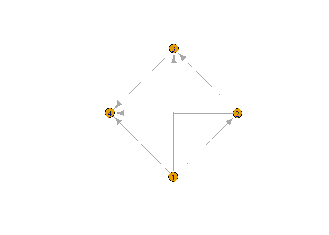

<!-- README.md is generated from README.Rmd. Please edit that file -->

# imediation

<!-- badges: start -->

<!-- badges: end -->

The goal of imediation is to provide an easy access to the individual
mediation effects in complicated multivariates situation.

## Installation

You can install the released version of imediation from
[CRAN](https://CRAN.R-project.org) with:

``` r
install.packages("imediation")
```

And the development version from [GitHub](https://github.com/) with:

``` r
# install.packages("devtools")
devtools::install_github("jiezhou-2/imediation")
```

``` r
library(imediation)
library(combinat)
#> 
#> Attaching package: 'combinat'
#> The following object is masked from 'package:utils':
#> 
#>     combn
library(pracma)
#> 
#> Attaching package: 'pracma'
#> The following object is masked from 'package:combinat':
#> 
#>     fact
library(igraph)
#> 
#> Attaching package: 'igraph'
#> The following objects are masked from 'package:stats':
#> 
#>     decompose, spectrum
#> The following object is masked from 'package:base':
#> 
#>     union
```

## Example 1. A mediation model with 2 continuous mediators and binary treatment and outcome

``` r
#adjacency matrix
AA=matrix(0,nrow = 4,ncol =4)
A=matrix(c(0,1,0,0),nrow=2)
AA[c(2,4),1]=1
AA[3,1]=0
AA[4,c(1,2,3)]=1
AA[2:3,2:3]=A
#create graph
g1=graph_from_adjacency_matrix(adjmatrix = t(AA))
plot.igraph(g1)
```


## Example 2. A mediation model with 10 continuous mediators and binary treatment and outcome

``` r
##adjacency matrix
AA=matrix(0,nrow = 12,ncol =12)
A=matrix(nrow = 10, ncol = 10)
A[10,]=c(0,0,0,1,0,0,0,0,0,0)
A[9,]=c(0,0,1,0,0,0,0,0,0,0)
A[8,]=c(0,0,1,0,0,0,0,0,0,0)
A[7,]=c(0,1,0,0,0,0,0,0,0,0)
A[6,]=c(0,1,0,0,0,0,0,0,0,0)
A[5,]=c(1,0,0,0,0,0,0,0,0,0)
A[4,]=c(0,0,0,0,0,0,0,0,0,0)
A[3,]=c(0,0,0,0,0,0,0,0,0,0)
A[2,]=c(0,0,0,0,0,0,0,0,0,0)
A[1,]=c(0,0,0,0,0,0,0,0,0,0)
AA[2:5,1]=1
AA[12,1]=1
AA[12,2:11]=1
AA[2:11,2:11]=A
#create graph 
g1=graph_from_adjacency_matrix(adjmatrix = t(AA))
plot.igraph(g1)
```



``` r
set.seed(1)
data=binary(size = 200)
form=vector( "list",2)
form[[1]]=rep(0,10)
form[[2]]=matrix(0,nrow = 10, ncol = 10)
result=regression(form = form,type = "binomial",data = data,C=A)
mintercept = result$mcoe[1,]
mcov=result$mcov
ocoe_intercept=result$ocoe_intercept
ocoe_confounder=result$ocoe_confounder
ocoe_tm=result$ocoe_tm
ocoe_mm=result$ocoe_mm
p=10
BB=matrix(0,nrow = p+2,ncol = p+2)
BB[2:(p+1),1]=result$mcoe[2,]
BB[p+2,1]=result$ocoe_treatment
BB[p+2,2:(p+1)]=result$ocoe_mediator
BB[2:(p+1),2:(p+1)]=result$B
a1=combinat::hcube(rep(2,10), scale = 1)
us=ifelse(a1==1,0, 1)
effect2=matrix(nrow = 2^5,ncol = 3)
s=c(1,2,5)
for (j in 1:3) {
 for (m in 1:2^5) {
   effect2[m,j]=beffect(
     index=s[j],
     u=us[m,],
     mintercept=mintercept,
     BB=BB,
     type="binomial",
     ocoe_tm=ocoe_tm,
     ocoe_confounder=ocoe_confounder,
     ocoe_intercept=ocoe_intercept,
     ocoe_mm=ocoe_mm
     )
 }
 }
 boxplot(effect2)
```


## Example 3. A high-dimensional mediation model with 100 continuous mediators and binary treatment and outcome
